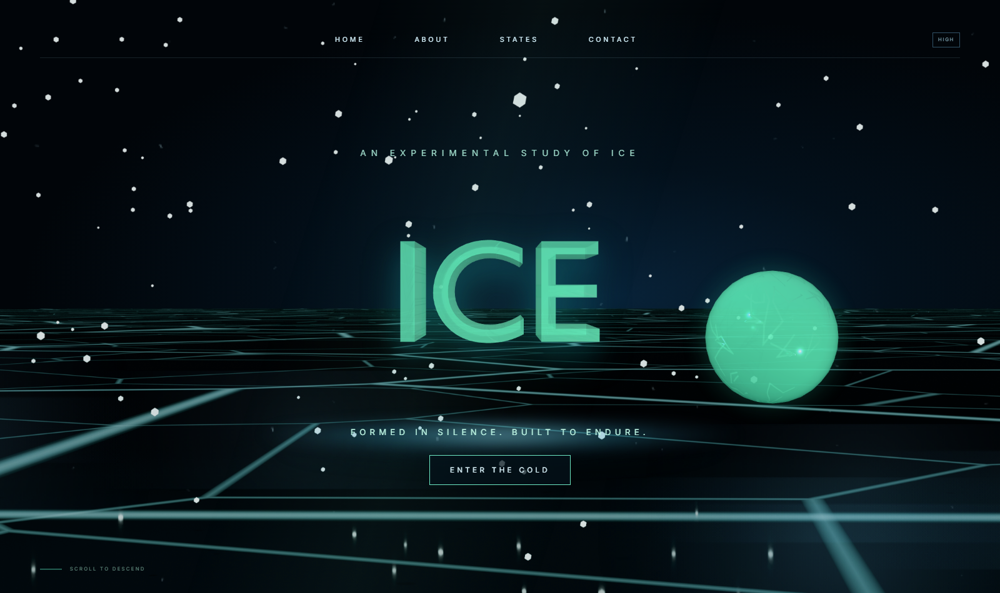

# ICE — An Experimental Study of Ice

**[Live site →](https://ice-gold.vercel.app)**



A one-page, cinematic React + Three.js experience built around a single word: **ICE**. Real 3D glass typography, a draggable ice sphere, an interactive ice sword, and a scroll-driven descent through a frozen archive — all running as live WebGL, with a fully-styled CSS/canvas fallback for devices that can't handle it.

This is the "Ice" entry in a four-elements series of visual studies (Fire already exists as a sibling project) exploring how far a single design idea can be pushed with real-time 3D, procedural materials, and motion design.

## Highlights

- **Live 3D typography** — the hero "ICE" text and the companion sphere are real glTF models (authored in Blender, exported lightweight) rendered with Three.js `MeshPhysicalMaterial` glass shading and a procedurally generated crack normal map (no texture download).
- **Fully interactive** — every 3D piece (hero text, sphere, sword in the Object section) supports drag-to-rotate, arrow-key rotation, and idle cursor-follow parallax, with a crack sound effect on grab.
- **Graceful degradation** — a one-time device-capability check (not a runtime FPS gate that fights the user mid-interaction) decides whether to render live WebGL or a matching static/CSS fallback, with real error boundaries around every 3D component.
- **Real asset pipeline** — a 730K-polygon Blender scene became a single pre-rendered background image rather than a doomed live load; a 4MB textured sword got its textures resized and modifiers applied down to ~1.4MB before ever reaching the browser.
- **Scroll-driven narrative** — GSAP + ScrollTrigger carry the page through Memory, States, Object, and Ending sections, each with its own reveal choreography.
- **Sound design** — short, licensed crack/freeze effects tied to key interactions (CTA click, grabbing a 3D piece, replay), never autoplaying.

## Tech stack

- [React 19](https://react.dev/) + [TypeScript](https://www.typescriptlang.org/)
- [Three.js](https://threejs.org/) (raw, no React renderer) for all live 3D
- [GSAP](https://gsap.com/) + ScrollTrigger for scroll/entrance choreography
- [Vite](https://vitejs.dev/) for dev/build
- Assets authored in **Blender**, exported as optimized `.glb` / pre-rendered `.png`
- Deployed on [Vercel](https://vercel.com/)

## Project structure

```
src/
  components/   React components (3D pieces, ambient canvas, error boundary)
  lib/          utilities (quality detection, sound, procedural textures, webgl check)
  App.tsx       page composition + scroll timeline
  main.tsx      entry point
  styles.css    all styling
public/
  models/       .glb assets served to the browser
  images/       backgrounds and fallback renders
  audio/        interaction sound effects
```

## Running locally

```bash
npm install
npm run dev       # start the dev server
npm run build      # type-check + production build
npm run preview   # preview the production build locally
```

## Credits

Concept, direction, and iteration by [@imacul](https://github.com/imacul). Built with Claude Code.
